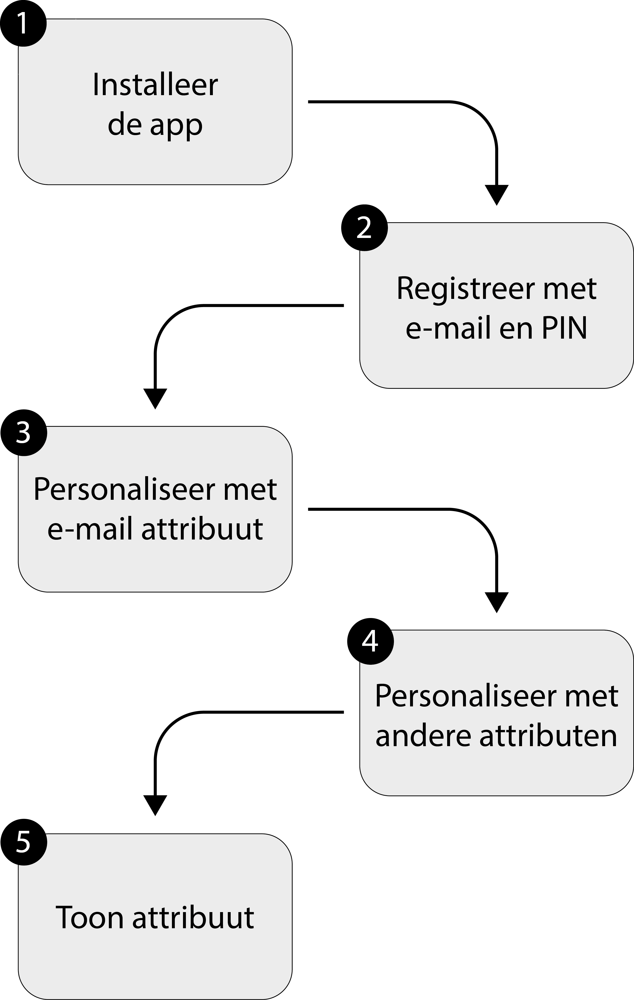
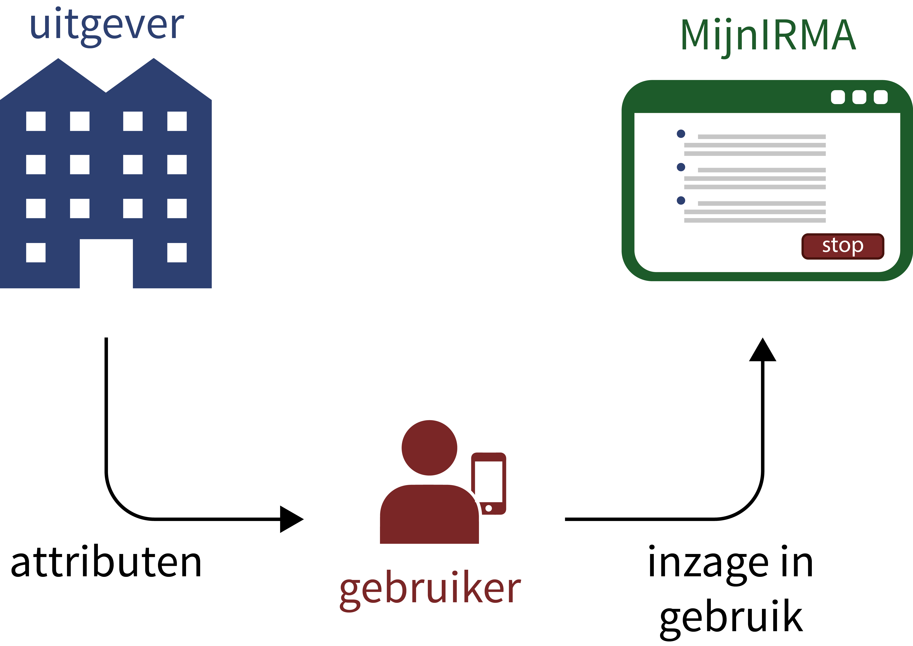

Deze pagina geeft antwoord op de volgende vragen.

 1. [Wat u moet doen om met IRMA van start te gaan](#vanstart)
 2. [Waarvoor is MijnIRMA?](#mijnirma)
 3. [Wat gebeurt er op de achtergrond?](#achtergrond)

Het laatste punt is helemaal niet nodig voor het gebruik van IRMA; het
geeft alleen aanvullende achtergrond informatie voor mensen die meer
van IRMA willen begrijpen.

### 1. Wat u moet doen om met IRMA van start te gaan?

Hieronder wordt in een paar stappen verteld wat u moet doen om de IRMA
app te kunnen gebruiken:

Het is verstandig hier even rustig voor te gaan zitten.  Deze stappen
kosten een klein beetje tijd en aandacht. U gaat nu een persoonlijke
elektronische identiteit voor uzelf maken die u nog lang kunt
gebruiken, voor soms gevoelige persoonlijke zaken, zoals inloggen of
digitaal ondertekenen. Dit lijkt een beetje op het aanvragen en
ophalen van een paspoort.  Maar zo'n paspoort kost heel veel meer tijd
en moeite, bijvoorbeeld omdat u er (twee keer) voor naar een
gemeentehuis moet gaan. Net als een paspoort is het ook IRMA echt
persoonlijk: het is niet de bedoeling dat iemand anders er gebruik van
kan maken.

#### 1.1. Installatie

De IRMA app is beschikbaar via de [Download](/download) pagina van de
stichting. U kunt de IRMA app ook rechtstreeks op uw telefoon of
tablet installeren vanuit de Android Playstore of Apple App Store.

#### 1.2. Registratie

Als u de IRMA app voor de eerste keer opent, kunt u in het begin
scherm een accout openen. Als u dat doet wordt u gevraagd om:

 * een PIN code van 5 cijfers

Denk AUB even goed na voordat u de PIN code kiest. U zult deze code
regelmatig nodig hebben bij het gebruik van de IRMA app. Deze code
garandeert dat u echt degene bent die uw IRMA app gebruikt. Kies geen
voor de hand liggende code als 00000. Als u de code ergens opschrijft,
doe dat dan zorgvuldig op een speciale plaats (of manier) zodat
anderen er niet snel bij kunnen. De app vraagt om de ingetypte code
nog een keer te herhalen, om fouten bij het intypen te voorkomen.

Iedere keer dat u uzelf authenticeert met IRMA, door het tonen van
IRMA attributen, is de PIN code nodig. Ook voor het zetten van een
digitale handtekening met IRMA is de PIN code nodig.

Het veranderen of opvragen van de PIN code is (op dit moment) niet
mogelijk.  Als u uw PIN code kwijtraakt, moet u zich opnieuw voor IRMA
registreren en gaan al uw tot dan toe verzamelde attributen
verloren. Dat is gedoe.  

Bij registratie kunt u ook een email adres opgeven. Dit is verstandig
want via dit email adres kunt uw registratie blokkeren bij de
stichting, op de [MijnIRMA](/mijnirma)
webpagina. [Hieronder](#mijnirma) wordt daar meer informatie over
gegeven. Het opgeven van een email adres is niet verplicht. Als u dat
niet doet weet de stichting niets anders van u dan een willekeurige
gebruikersnaam die voor u gegenereerd is.  U kunt die gebruikersnaam
zien door te klikken op "MijnIRMA login" in het attributen overzicht
in de IRMA app.

Als u een email adres toevoegt, gebruik dan wel een adres dat echt (en
exclusief) van u is en dat u nog lang zult gebruiken. U krijgt direct
een eerste mailtje op dit adres met een link voor de
bevestiging. Hiermee wordt gecontroleerd of het adres wel echt van u
is.

Het email adres kan in uitzonderlijke situaties gebruikt worden om
contact met u te houden over het gebruik van IRMA. Het adres wordt
niet met anderen gedeeld.

#### 1.3. Personalisatie met uw email adres

Het email adres dat u mogelijk opgegeven heeft bij registratie kan nu
als attribuut in de IRMA app in uw telefoon gezet worden. Na de vorige
registratie stappen, waarin u uw PIN gegeven hebt, krijg u een link
(webadres) toegestuurd per email. Daarmee wordt uw registratie
bevestigd.

Wanneer u in een webbrowser naar het toegstuurde webadres gaat krijgt
u een "Email Uitgifte" knop te zien. Hier ziet u hoe het uitgeven en
ontvangen van attributen werkt.

 * Wanneer u de webpagina in een browser op een PC of laptop geopend
   heeft en op de "Email Uitgifte" knop drukt wordt een QR code
   getoond. Pak uw telefoon, open de IRMA app en tik op de "scan balk"
   bovenin de app. De camera van uw telefoon wordt nu gestart, zodat u
   de QR code kunt scannen. Nadat u dit gedaan heeft, vraagt de app u
   of u uw email adres als attribuut wil accepteren in de IRMA app op
   uw telefoon.

 * Wanneer uw de webpagina in een browser op de telefoon zelf opent en
   op de "Email Uitgifte" knopt drukt, wordt de IRMA app op uw
   telefoon vanzelf geopend. U krijgt dan ook de vraag of u uw email
   adres als attribuut wil accepteren op uw telefoon.

#### 1.4. Personalisatie met andere attributen

Het is mogelijk nog meer attributen te ontvangen dan uw email adres.
Met die attributen kunt u een persoonlijk "paspoort" opbouwen in uw
IRMA app.  U kunt dat meteen na de registratie doen, maar het kan ook
later.  U gaat daarvoor naar de [IRMA uitgifte](/uitgifte) pagina. U
ziet daar verschillende mogelijkheden om nog meer attributen op te
nemen in de app. Dit lijstje mogelijkheden ligt niet vast en zal
groeien naarmate meer partijen aan IRMA meedoen.

 * iDIN levert uw naam, adres, woonplaats, en geboortedatum
   attributen.  Nadat u bij uw eigen bank, met eigen middelen, heeft
   ingelogd, kunnen deze attributen in uw IRMA app gezet worden. Dit is
   beschikbaar voor iedereen met een bankrekening in Nederland, zie
   [iDIN](https://www.idin.nl).

 * SURFconext levert attributen van uw (eventuele) hoger onderwijs
   identiteit. Deze is in principe beschikbaar voor studenten en
   medewerkers van instellingen voor onderwijs en onderzoek in
   Nederland die aangesloten zijn op
   [SURFconext](https://www.surfconext.nl). Uw eigen instelling moet
   IRMA toegang wel expliciet goedkeuren. Via SURFconext kunnen
   "onderwijs attributen" in uw IRMA app gezet worden.

* ...

### 2. Waarvoor is MijnIRMA?

De [MijnIRMA](/mijnirma) website van de stichting biedt de volgende
mogelijkheden.

* U kunt er het gebruik van uw eigen IRMA app volgen: de *log*
  gegevens zijn er zichtbaar. U kunt zien wanneer uw app attributen
  getoond heeft en ook wanneer de app attributen ontvangen heeft. Het
  is echter niet zichtbaar om welke attributen het gaat, aan welke
  controleur u attributen getoond hebt, of van welke uitgever u
  attributen ontvangen heeft. De stichting wil deze zaken niet weten,
  en kan ze daarom ook niet aan u laten zien. Dit is verankert in het
  *privacy by design* ontwerp van IRMA.

  Het is verstandig af en toe eens naar deze loggegevens te
  kijken. Als daar blijkt dat uw IRMA app gebruikt wordt terwijl u
  daar helemaal niet van weet is er iets aan de hand: iemand anders
  gebruikt uw app om zich als u voor te doen. Dat is reden om
  direct in te grijpen. Hiermee komen we aan de tweede mogelijkheid
  die de MijnIRMA pagina biedt.

* U kunt op de MijnIRMA webpagina het gebruik van IRMA stop zetten.
  Natuurlijk kunt u dat doen als u IRMA niet langer wil
  gebruiken. Maar daarnaast is het belangrijk om aan deze "noodrem" te
  trekken als uw telefoon gestolen is, zodat een ander zeker geen
  misbruik kan maken van uw identiteit.

  Als u op MijnIRMA aangeeft te willen stoppen worden al uw gegevens
  onmiddelijk gewist en kan uw IRMA app niet meer gebruikt worden, ook
  al staat de app nog op uw telefoon. Mocht u hierna IRMA ooit toch
  nog willen gaan gebruiken, dan moet u zich opnieuw, van voor af aan
  registreren.

* U kunt op de MijnIRMA pagina ook beheren welk email adres aan uw
  account gekoppeld is.

Inloggen op de MijnIRMA webpagina kan op twee manieren:

1. Met IRMA zelf, via uw "MijnIRMA login" attribuut.
2. Door uw email adres in te typen; u krijgt dan een link toegestuurd
   op dit adres, die u toegang geeft tot uw account.

Deze laatste optie kunt u alleen gebruiken wanneer u eerder een email
adres aan uw account gekopped heeft. Dit is vooral nuttig wanneer uw
telefoon gestolen is --- en de eerste optie niet werkt. Als u uw mail
op een ander apparaat leest, kunt u vandaaruit inloggen op MijnIRMA en
uw IRMA account stopzetten. 

Omwille van deze tweede manier van inloggen is het verstandig
een email adres aan uw IRMA account te koppelen. 

### 3. Wat gebeurt er op de achtergrond?

De tekst hieronder gaat dieper in op wat er onder de motorkap gebeurt
wanneer u zich via de IRMA app registreert. Deze achtergrond
informatie is niet nodig voor het daadwerkelijke gebruik van IRMA,
maar is bedoeld voor mensen die technisch geïnteresseerd zijn en
willen weten hoe de zaken opgezet zijn en hoe beveiliging en privacy
bescherming in het IRMA ecosysteem georganiseerd zijn. Nog
uitgebreidere informatie is beschikbaar op een [aparte
pagina](/irma-uitleg).

Een eerste uitgangspunt is dat de IRMA app strikt persoonlijk is en
niet makkelijk door een ander misbruikt moet kunnen worden. Dit
gebeurt via een persoonlijke PIN code die u bij registratie
kiest. Natuurlijk kunt u uw telefoon met eigen attributen in een IRMA
app tezamen met de PIN aan iemand anders geven.  Dat is net zo
onverstandig als uw bankpas met PIN aan een ander geven.  Daar is geen
beveiligingsmechanisme tegen opgewassen.

We gaan er dus van uit dat IRMA gebruikers hun PIN code geheim
houden. De vraag is dan: waar is de PIN code opgeslagen? Hetzelfde
geldt voor de geheime persoonlijke cryptografische sleutel die nodig
is om de IRMA app voor u te laten werken.

De IRMA implementatie gebruikt een *split key* truuk, waarbij zulke
cruciale geheime informatie verdeeld wordt tussen de app en de
MijnIRMA server van de stichting. De app en de server moeten heel
precies samenwerken om IRMA te laten werken. Ze hebben daar ieder
alleen niet genoeg informatie voor: ze moeten samenwerken en hun eigen
geheimen apart gebruiken voor een gezamenlijke berekening. Dit heet
een *multi-party computation*.

De MijnIRMA server kan zich in zijn eentje dus nooit als u voordoen:
de app op uw telefoon is strikt noodzakelijk. Wat u wel op de server
kunt doen staat [hierboven](#mijnirma) beschreven. Het inloggen op de
MijnIRMA server kan via IRMA, maar ook via een link die per email
toegestuurd wordt naar een geregistreerd adres. Als uw telefoon
gestolen wordt, heeft de dief mogelijk ook toegang tot uw
email. Hij/zij kan daarmee ook op uw MijnIRMA inloggen. Maar het enige
wat de dief daar kan doen is uw account stopzetten. Als het goed is
heeft u dat zelf al gedaan zodra u de diefstal bemerkt.

Kortom: de MijnIRMA server biedt u extra bescherming en controle
mogelijkheden, maar kan zelf niks alleen doen -- behalve blokkeren. De
stichting Privacy by Design beheert de MijnIRMA server om het gebruik
van IRMA mogelijk te maken. Andere partijen kunnen in principe ook
zo'n server draaien.

De MijnIRMA server speelt ook een beschermende rol bij het gebruik van
uw PIN. Het is in het algemeen onverstandig als een PIN in een app
opgeslagen wordt, omdat die eruit gehaald zou kunnen worden als een
telefoon gehackt wordt.  De IRMA app slaat de PIN dus niet op, maar
wel een willekeurig groot getal dat een *nonce* genoemd wordt. De
MijnIRMA server weet ook uw PIN niet, maar krijgt bij registratie de
hash waarde *hash( PIN | nonce )* van uw app.  Hieruit is de PIN niet
af te leiden.

Wanneer u op uw app inlogt met uw PIN code, berekent de app dit
(grote) getal *hash( PIN | nonce )* en stuurt deze hash waarde naar de
MijnIRMA server. Daarna wordt de PIN verwijdert uit de app. Als de
hash waarde klopt, zijn de app en de server onderling gekoppeld en is
de inlog geslaagd.  Een succesvolle aanvaller kan eventueel wel de
nonce uit uw app halen, maar heeft daar niet zo veel aan. Het enige
wat de aanvaller kan doen is alle 100.000 mogelijkheden van uw PIN
uitproberen, en bij iedere poging *X* het getal *hash( X | nonce )*
naar de MijnIRMA server sturen. De server ziet dan dat zoiets
geprobeerd wordt en vertraagt de pogingen (*rate limiting*).

Het onderstaande plaatje vat de twee rollen van de stichting Privacy
by Design samen. Enerzijds is de stichting uitgever van een aantal
attributen voor het vullen van uw eigen IRMA app met eigen attributen
(personalisatie).  Anderzijds zorgt de stichting via MijnIRMA voor
inzage in het eigen IRMA gebruik en voor de mogelijkheid om het
gebruik van IRMA stop te zetten.

In het begin is de stichting de enige uitgever van IRMA
attributen. Hopelijk zullen andere partijen spoedig volgen.

De stichting verifieert ook attributen, maar alleen voor zichzelf,
wanneer IRMA gebruikers inloggen op MijnIRMA. Zulke verificaties
worden niet voor anderen gedaan. De stichting beperkt haar rol tot
uitgifte en inzage.
