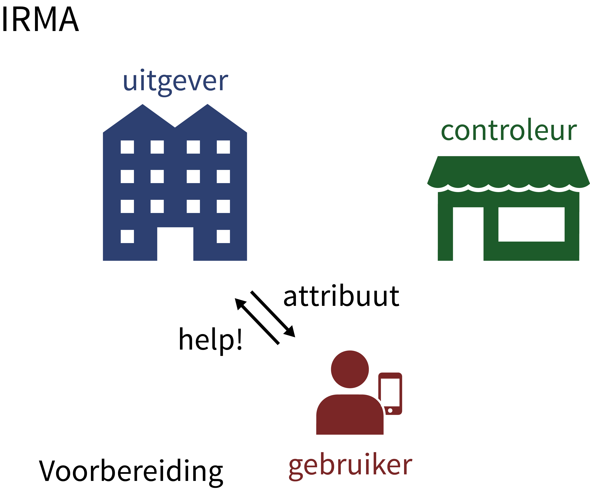
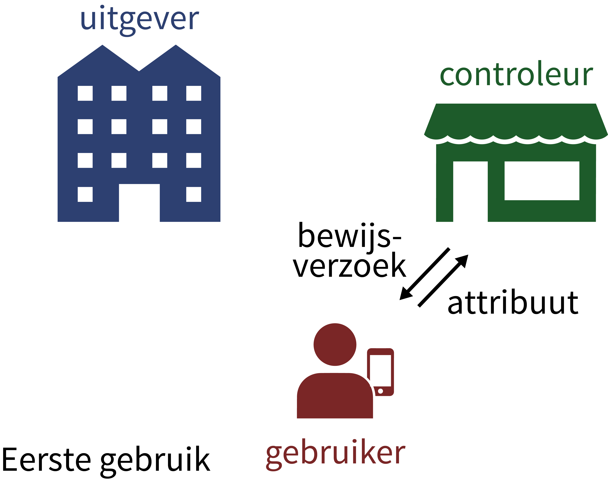
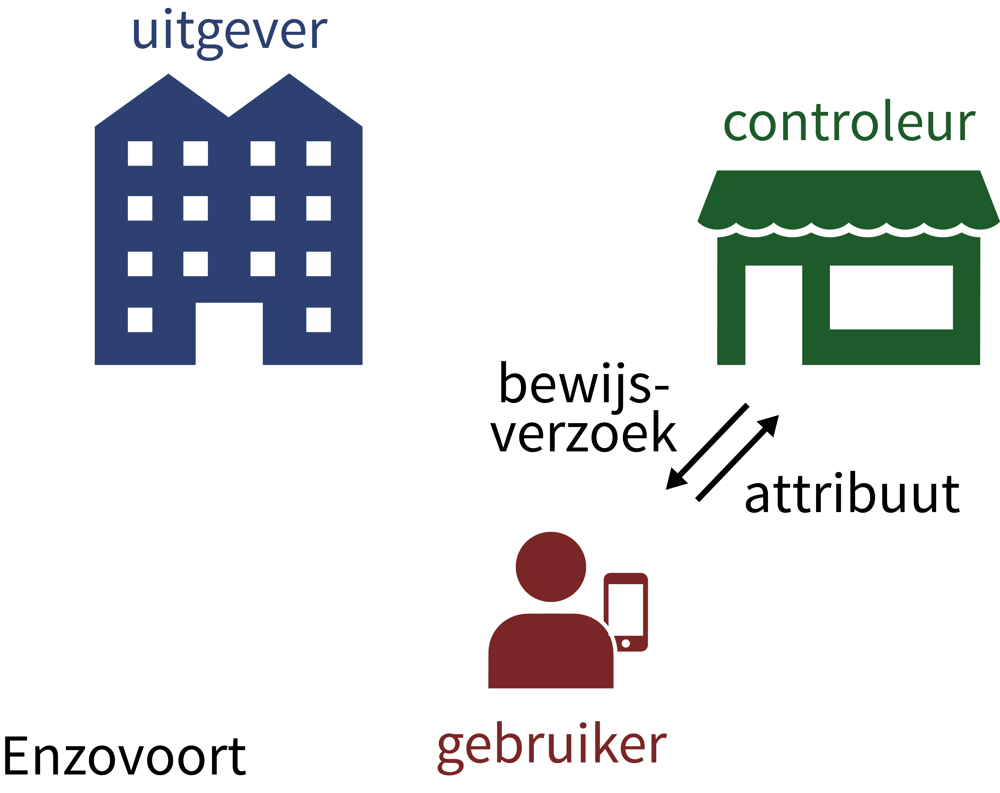
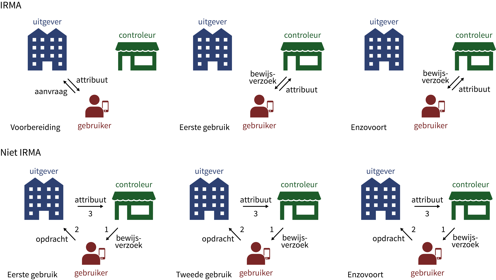

 Op deze pagina worden de ideeën achter het identity
platform IRMA beschreven en wordt ook uiteengezet hoe het systeem
werkt en is opgezet. De volgende onderwerpen komen achtereenvolgens
aan bod.

 1. [Waar gaat IRMA eigenlijk over?](#onderwerp)
 2. [Waarom zou u attributen willen gebruiken in plaats van identiteiten?](#waarom)
 3. [Hoe kom ik aan attributen en hoe gebruik ik ze?](#hoe)
 4. [Hoe verschilt IRMA van andere authenticatie systemen als iDIN en idensys?](#architectuur)
 5. [Wat zit er bij IRMA onder de motorkap?](#motorkap)
 6. [Welke privacy garanties geeft IRMA wel en niet?](#garanties)
 7. [Welke waarden zitten in de IRMA technologie ingebakken?](#waarden)
 8. [Wat zijn attribuut-gebaseerde handtekeningen?](#signature)
 9. [Wat zijn de nadelen van IRMA?](#nadelen)
 10. [Hoe kan ik meedoen of bijdragen?](#meedoen)

Deze vragen zullen hieronder een voor een beantwoord worden. Elders
staat kortere uitleg voor [IRMA app gebruikers](/irma-begin) en
voor [IRMA controleurs](/irma-controleur).

### 1. Waar gaat IRMA eigenlijk over?

Wanneer u een fles whisky koopt moet u volgens de wet bewijzen dat
u ouder dan 18 bent. U hoeft echter niet te vertellen wie u
bent. Enkel deze persoonlijke eigenschap, dat u ouder dan 18 bent, is
genoeg voor de whisky aankoop. Zulke persoonlijke eigenschappen worden
*attributen* genoemd.

IRMA is de naam voor een systeem dat precies dit doet. IRMA staat
voor: *I Reveal My Attributes*. IRMA stelt u in staat om online, via
uw mobiele telefoon, bepaalde attributen van u zelf wel te laten zien
("ouder dan 18"), maar ook om andere attributen juist niet te laten
zien (uw naam of telefoonnummer). IRMA beschermt daarmee uw
privacy. Deze privacy-bescherming zit ingebakken in het systeem, en
wordt daarom ook *privacy by design* genoemd. In de meeste recente
nationale en Europese wetgeving wordt privacy by design vereist voor
nieuwe ICT-systemen.

Naast intrinsieke privacy-bescherming biedt IRMA ook bescherming tegen
identiteitsfraude: als uw naam of geboortedatum helemaal niet genoemd
worden, kunnen ze ook niet misbruikt worden.

Hieronder staat een lijstje attributen die nuttig kunnen zijn,
bijvoorbeeld bij een webwinkel, bij de overheid, op een webforum, bij
een bank, enz.

* Ik ben een student (of een gepensioneerde)
* Ik ben ouder dan 12 (of 16, of 18, of 21, of 65)
* Ik ben jonger dan 12 (of ...)
* Mijn nationaliteit is ...
* Mijn geslacht is ...
* Mijn banknummer is ...
* Mijn huisadres is ...
* Mijn voor/achternaam is ...
* Mijn burgerservicenummer (BSN) is ...
* Mijn verzekeringsnummer is ...
* Mijn email adres is ...
* Mijn mobiele nummer is ...
* Mijn klantenkaart van bedrijf X heeft status brons / zilver / goud
* Mijn treinabonnement is eerste / tweede klas
* etc. etc.

Sommige van deze attributen zijn uniek-bepalend, zoals uw BSN: er
hoort een unieke persoon bij. Maar sommige andere attributen kunnen
anoniem gebruikt worden, zonder dat daarbij bekend wordt om wie het
precies gaat. Deze niet-identificerende attributen gelden voor
meerdere mensen.

Attributen vormen een natuurlijke manier om bepaalde aspecten van
uzelf te verbergen en anderen juist te laten zien. Er zijn heel veel
scenario's waarin attributen precies die informatie leveren die nodig
zijn voor een transactie.

* Als u mee wil doen met een online chat-box voor minderjarigen, moet
  u aantonen dat u jonger bent dan 15, bijvoorbeeld. Of als u mee
  wil doen in een online discussie groep van mensen met een bepaalde
  gevoelige ziekte, kan deze ziekte een attribuut zijn dat anoniem
  toegang geeft tot de groep.
* Wanneer u een gewelddadige game/video/boek online wil kopen moet u
  bewijzen dat u ouder dan 16 bent, of misschien zelfs ouder dan 18.
* Als u het "student" attribuut heeft kunt u bijvoorbeeld korting
  krijgen bij de kapper; en als u het "gehandicapt" attribuut van een
  bepaalde soort heeft, hebt u recht op speciaal vervoer.
* Als u online iets wil kopen moet u uw adres tonen voor de bezorging.
  Eventuele korting kunt u krijgen via een lidmaatschapsattribuut
  van de webwinkel. En eventueel moet u een leeftijdsattribuut laten
  zien als uw aankoop niet voor minderjarigen is. (We nemen even aan
  dat betaling via iDeal gaat, waarvoor de webwinkel geen
  bankrekeningnummer nodig heeft.)

[Naar boven](#top)

### 2. Waarom zou u attributen willen gebruiken in plaats van identiteiten?

Kortweg: attributen beschermen u en stellen u in staat om veel dingen
te doen.

Via een uniek persoonsnummer, zoals een paspoort nummer of een burger
service nummer (BSN), kunnen mensen in veel verschillende situaties
herkend worden en kunnen al hun handelingen in die situaties aan
elkaar gekoppeld worden. Dit heeft veel voordelen, bijvoorbeeld bij
publieke dienstverlening. Maar het kan ook serieuze nadelen hebben,
vooral wanneer dat unieke persoonsnummer door een ander misbruikt
wordt.  Dit heet identiteitsfraude, en is een van de grootste plagen
van het digitale tijdperk.

Wanneer u in plaats van unieke persoonsnummers anonieme attributen
gebruikt voor een transactie, dan speelt uw identiteit helemaal geen
rol en kan daarom ook niet gestolen worden. In die zin bieden
attributen bescherming.

Het gebruik van attributen in plaats van identiteiten heeft nog meer
voordelen.

* Het is privacy-vriendelijk vanwege *data-minimalisatie*. Alleen die
  attributen die relevant en noodzakelijk zijn voor een transactie
  hoeven onthuld te worden.
* Het geeft de gebruiker, in ieder geval bij IRMA, werkelijke controle
  en zicht op wie welke gegevens vraagt.
* Het is flexibel en past in veel verschillende situaties.
* Het voorkomt het onderling koppelen van verschillende transacties,
  zolang daar geen uniek-identificerende attributen voor nodig
  zijn. Daarmee wordt openlijk of stiekem profileren tegengegaan, en
  alles wat daarmee samenhangt, zoals prijsdifferentiatie (de prijs die
  u moet betalen hangt af van het profiel dat van u opgebouwd is).

In veel digitaliseringsprojecten in de afgelopen tientallen jaren zijn
attributen uit het dagelijkse leven vervangen door vaste digitale
identiteiten. Een voorbeeld is de OV-chipkaart. Traditioneel voldeed
een papieren kaartje voor de bus of trein. Daarmee kon je anoniem
reizen, zonder dat centraal vastgelegd werd waarheen u zoal reist en
zonder dat al uw verschillende reizen onderling gekoppeld konden
worden. Nu moet u uw identiteit onthullen om te reizen via het unieke
nummer van een OV-chipkaart. Via zulke kaarten kunnen al uw reizen
bijgehouden en gekoppeld worden, gebruikt worden voor marketing
doeleinden, en mogelijk openbaar worden door een hack of door
slordigheid. Anonieme OV-chipkaarten bieden weinig bescherming, omdat
bij herstel van een fout of geld-teruggave van een verlopen kaart u
toch uw identiteit moet onthullen. Daarmee wordt er een koppeling
gelegd tussen u en al uw eerdere reizen, waarvan u dacht dat ze
anoniem waren.

Attribuut-gebaseerde systemen brengen de traditionele bescherming en
flexibiliteit voor gebruikers voor een deel weer terug. Daarnaast
bieden ze bescherming aan service providers tegen de eventuele nare
gevolgen van totale anonimiteit, omdat u kunt eisen dat deelnemers
toch iets van zichzelf onthullen, bijvoorbeeld dat ze vrouw zijn of
onder de 12, in discussiegroepen speciaal voor vrouwen of voor
kinderen.

[Naar boven](#top)

### 3. Hoe kom ik aan attributen en hoe gebruik ik ze?

In het IRMA identity platform worden uw persoonlijke attributen
beveiligd opgeslagen in de IRMA app op uw eigen telefoon (of
tablet). De app heeft een eigen PIN die nodig is voor het gebruik. Die
PIN moet er voor zorgen dat niemand anders uw attributen in de app kan
gebruiken, en zich daarmee als u voor kan doen. Natuurlijk is het goed
als uw telefoon een eigen inlog patroon of code heeft. Maar
daarbovenop heeft de IRMA app nog weer een eigen PIN, net zo als de
verschillende apps voor mobiel bankieren een eigen PIN hebben.

Attributen die voor u gelden kunt u downloaden in uw IRMA app op uw
telefoon. Dat kan via het [web](/uitgifte), door het scannen van een
QR-code, maar dat kan ook ter plekke, bijvoorbeeld aan een balie. De
organisatie die attributen uitgeeft heet een *attribuut uitgever* of
gewoon een *uitgever* (in het engels: *issuer*). Er zouden
verschillende attribuut uitgevers kunnen zijn, zoals:

* de nationale overheid, of een gemeente, voor attributen als: naam,
  adres, geboortedatum, BSN, rijbevoegdheid, categorie van inkomen,
  etc.
* banken en verzekeringsmaatschappijen, voor attributen als: bank- en
  verzekeringsnummers, soort van verzekering, etc.
* internet service providers en telecom operators, voor:
  email-adressen, telefoonnummers en IP-nummers
* de Facebook's / Google's / Apple's  / Amazon's / Microsoft's van deze
  wereld, voor login gegevens
* grote of kleine webshops, voor eigen klantenkaarten met bijbehorende
  status, coupons, etc.
* bedrijven en andere organisaties, voor attributen ten behoeve van
  verfijnde rol-gebaseerde toegangscontrole
* ziekenhuizen en andere gezondheidsinstellingen, voor regulering van
  toegang niet alleen voor het eigen personeel, maar ook voor
  patiënten
* blockchain initiatieven, voor authenticatie van gebruikers en hun rollen
* militaire organisaties, voor al hun verschillende rangen,
  compartimentalisaties en clearances, en leden van special forces van wie
  identificerende gegevens typisch niet onthuld worden
* etc.

Op dit moment wordt IRMA helaas nog niet zo breed geaccepteerd en
ondersteund dat al deze partijen zulke attributen ook daadwerkelijk
uitgeven. Maar sommigen van hen kijken wel serieus naar de
mogelijkheden.

Als u als IRMA gebruiker een attribuut wilt ontvangen van zo'n
uitgever moet u zich eerst op een of andere wijze authenticeren
(bewijzen wie u bent). Vervolgens kan de uitgever bij u horende
attributen in het eigen systeem opzoeken en aan uw IRMA app geven,
voorzien van een digitale handtekening. Concreet: om de attributen van
uw bank in uw IRMA app te krijgen moet u eerst inloggen bij uw bank.
Dit is precies wat bij [iDIN](/uitgifte-idin) gebeurt.

Als uw IRMA app eenmaal een paar attributen heeft kunt u die gaan
gebruiken voor transacties. In zulke transacties zal een andere partij
(denk aan een webshop) bijvoorbeeld vragen wat uw adres (attribuut)
is. Nadat u daar in de IRMA app expliciet toestemming gegeven heeft
wordt dit attribuut door de app aan de webshop getoond. Via
cryptografische berekeningen kan de webshop controleren dat het
attribuut echt is, niet verlopen, niet gemanipuleerd, uitgegeven is
door een specifieke uitgever, en ook dat het echt bij u hoort (of
eigenlijk: bij uw telefoon). Deze vragende partij, die attributen van
u wil zien, wordt ook wel de *controleur* genoemd. Er is een aparte
[pagina](/irma-controleur) met uitleg over de rol van controleurs.

Het zit in het IRMA systeem ingebakken dat deze controleurs in de IRMA
app duidelijk moeten laten zien om welke attributen ze vragen. U, als
gebruiker, moet expliciet toestemming geven voor het vrijgeven van die
attributen. Zo ziet u steeds duidelijk wie wat van u wil weten. De
IRMA app houdt een log bij zodat u later nog kunt zien welke
controleur wat gevraagd heeft en wat u heeft laten zien. Als er
controleurs zijn die buitenproportioneel veel informatie vragen voor
een simpele transactie kunt u daarover ook een klacht indienen, met
die IRMA loggegevens in de hand, bijvoorbeeld bij de Autoriteit
Persoonsgegevens.

(De stichting Privacy by Design houdt een minimale log bij van
al uw transacties, zodat u eventueel misbruik kunt detecteren,
zie de [MijnIRMA uitleg](/irma-begin/#mijnirma). Deze log bevat
geen informatie over de attributen die zijn gevraagd en/of getoond,
en kan niet gebruikt worden als basis voor een klacht.)

IRMA Attributen zijn voorzien van een digitale handtekening van de
uitgever.  Daarmee kan de attribuut controleur de echtheid en de
herkomst controleren. Attributen hebben een geldigheidsdatum, die ook
door de controleur gecheckt kan worden. Als de geldigheid verlopen is
moeten attributen door de gebruiker ververst worden, door opnieuw naar
de uitgever te gaan. Dat werkt net als bij een paspoort,
identiteitskaart, of rijbewijs: op een goed moment is het verlopen, en
heeft u een nieuwe nodig. Het verversen van IRMA attributen is echter
veel makkelijker: dat kan gewoon online.

De onderstaande drie plaatjes geven een schematisch overzicht, eerst
van het downloaden van attributen bij een uitgever, en
vervolgens van het gebruik bij twee verschillende webwinkels.

Dit downloaden en tonen van attributen is een natuurlijke vorm van
modern *identity management*. Hiermee verzamelt en onderhoudt u een
eigen persoonlijk digitaal paspoort in uw IRMA app. Dit soort "regie
op gegevens" of "personal data management" lijkt een beetje op het
installeren, beheren en verwijderen van de verschillende apps op een
telefoon of tablet.

[Naar boven](#top)

### 4. Hoe verschilt IRMA van andere authenticatie systemen als iDIN en idensys?

IRMA is wezenlijk verschillend van andere identity management systemen
zoals [Facebook
login](https://developers.facebook.com/docs/facebook-login), of
[iDIN](http://www.idin.nl).  IRMA heeft een *decentrale*
architectuur. Uw attributen zijn alleen bij u op de telefoon
opgeslagen, en niet centraal op de computer van een of andere
"identity broker". Wanneer u wilt bewijzen dat u ouder dan 18 bent
tegenover een webshop doet u dat met IRMA rechtstreeks met die
webshop, zonder tussenkomst van een "makelaar" of een "broker" of wie
dan ook die hier niks mee te maken heeft. Door deze decentrale
architectuur van IRMA kan dus niet door derde partijen bijgehouden
worden:

* welke attributen u heeft
* waar u die gebruikt
* wanneer u die gebruikt.

Op deze manier biedt IRMA optimale privacy-bescherming, by design.

Ter vergelijking: als website X authenticatie van gebruikers vereist,
niet via IRMA, maar zeg via Facebook login, dan wordt u naar Facebook
doorverwezen als u bij X in wil loggen. Na zo'n login bij Facebook,
met uw Facebook wachtwoord, stuurt Facebook bepaalde informatie over u
door naar de website X. Op deze manier ziet Facebook waar u allemaal
inlogt en verzamelt Facebook deze informatie om uw profiel uit te
breiden en op u gerichte advertenties aan te passen. Daarbij is het
niet duidelijk welke informatie over u door Facebook aan website X
gegeven wordt.

Veel identity management systemen zijn op zo'n *gecentraliseerde*
manier georganiseerd, om commerciële redenen: de eigenaars van deze
systemen kunnen zo niet alleen profielen van alle gebruikers opbouwen
en verkopen --- wie logt wanneer waar in met welke gegevens --- maar
zij kunnen ook kosten in rekening brengen voor iedere authenticatie,
precies omdat ze in het midden zitten en alle communicatie via hun
systemen verloopt.

Nog een voorbeeld: als u het systeem iDIN van de Nederlandse banken
gebruikt voor authenticatie kan uw bank in principe zien of en wanneer
u inlogt bij een slijter of bij een psychiatrische kliniek. De banken
[beweren](https://www.idin.nl/consumenten) dat ze die informatie niet
voor andere doeleinden zullen gebruiken, bijvoorbeeld bij beslissingen
of u wel of niet een hypotheek krijgt. De decentrale architectuur van
IRMA zorgt ervoor dat dit soort lastige vraagstukken helemaal niet
optreden. Daarbij moeten webwinkels iDIN per authenticatie sessie betalen.
De prijzen daarvoor zijn een punt van zorg, en hebben al tot klachten
geleid. Nogmaals, met IRMA zijn er niet zulke kunstmatig gecreëerde
kosten die afgedwongen worden door een centrale architectuur.

De Nederlandse overheid heeft in juni 2017 de stekker getrokken uit
het voorgestelde nationale identity management systeem
[idensys](https://www.idensys.nl/). Bij het centralistisch opgezette
Idensys speelden dezelfde privacy- en kosten-problemen als bij iDIN.

Het verschil tussen een decentrale (IRMA) en centrale (niet-IRMA)
opzet wordt hieronder nog eens beschreven.

Duidelijk is dat in de niet-IRMA opzet de uitgever van attributen een
*privacy hotspot* is die bij alle transacties een vinger in de pap
heeft. Bovendien kan, in de centralistische opzet, een kwaadaardige
uitgever in principe uw identiteit overnemen en doen alsof hij u is. U
hebt geen manier om dat tegen te houden, of zelfs maar te merken ---
totdat u mogelijk later met de consequenties geconfronteerd wordt. In
de gedecentraliseerde IRMA architectuur heeft u wel degelijk echte
volledige controle over het gebruik van uw gegevens: u onthult zelf,
rechtstreeks uw eigen attributen, iedere keer enkel na expliciete
toestemming, zonder (onnodige) bemoeienis van derde partijen. Met IRMA
werkt dit net zo als bij uw gewone paspoort, dat u ook kunt tonen
zonder bemoeienis of afhankelijkheden van anderen.

Het IRMA systeem heeft niet zulke *privacy hotspots*. Op meta-niveau
vereist IRMA wel dat er enige coördinatie is over hoe attributen en
credentials georganiseerd worden en welke (publieke) cryptografische
sleutels waar voor nodig zijn. Deze coördinerende rol wordt vervuld
door de stichting Privacy by Design. De stichting kan echter op geen
enkele manier zien wie welke attributen waar gebruikt.

De stichting monopoliseert niet. Het IRMA systeem is open (source) en
gratis beschikbaar en is in principe door iedereen te gebruiken. Ook
andere partijen kunnen de huidige coördinerende en/of uitgevende rol
van de stichting vervullen. In feite zou het beter zijn wanneer
[iDIN](/uitgifte-idin) of het [BIG register](/uitgifte-big) zelf hun
attributen rechtstreeks zouden uitgeven aan IRMA gebruikers, in plaats
van dat de stichting dit op indirecte wijze doet --- op dit moment,
hopelijk tijdelijk.

Gedecentraliseerde en gecentraliseerde identity management systemen
hoeven elkaar niet uit te sluiten: ze kunnen goed naast elkaar bestaan
en samenwerken, bijvoorbeeld bij het verkrijgen van IRMA attributen
uit iDIN. IRMA is het best te gebruiken voor toepassingen waar privacy
een (grote) rol speelt, of waar attributen nodig zijn die niet
makkelijk op een centralistische wijze georganiseerd kunnen worden,
bijvoorbeeld vanwege wettelijke beperkingen of vanwege een gebrek aan
vertrouwen in centrale opslag onder gebruikers. IRMA kan ook goed met
"tijdelijke" attributen omgaan, zoals bijvoorbeeld een toegangskaartje
voor een concert dat u online koopt, met daarin de naam, datum en
plaats van het concert. Zo'n kaartje kunt u dan als attribuut
downloaden, bij de ingangscontrole van het concert tonen, en daarna
uit uw telefoon verwijderen. (Zulke kaartjes zijn strikt persoonlijk
en niet-overdraagbaar, omdat ze cryptografisch verbonden zijn aan
uw persoonlijke IRMA app.)

Een subtiel punt is in hoeverre IRMA het beter doet dan
gecentraliseerde architecturen die intrinsiek een
*single-point-of-failure* hebben; wanneer dat centrale punt onderuit
gaat, werkt geen enkele authenticatie meer. In feite heeft IRMA ook
een kleine centrale *keyshare* component, zoals [hierna](#motorkap)
nader uitgelegd wordt, zodat IRMA gebruikers hun activiteiten kunnen
monitoren en zonodig stop zetten. Deze centrale component speelt een
rol bij iedere onthulling en uitgifte van attributen. Het is daarmee
ook een single-point-of-failure.

[Naar boven](#top)

### 5. Wat zit er bij IRMA onder de motorkap?

De komende paragrafen overlappen enigszins met de [uitleg](/irma-begin)
om van start te gaan met IRMA, in het bijzonder met het
laatste gedeelte daarvan over [registratie](/irma-begin/#achtergrond).

Met iets meer technische details zal hier uitgelegd worden waarom IRMA
privacy-vriendelijk en goed-beveiligd is. IRMA is gebaseerd op
geavanceerde cryptografie, voor attribuut-gebaseerde credentials.
Deze credentials zijn containers met daarin een aantal attributen,
voorzien van een geldigheidsdatum en een digitale handtekening, van de
uitgever. De onderliggende cryptografie is gebaseerd op
[Idemix](http://www.research.ibm.com/labs/zurich/idemix/) dat vanaf
eind jaren negentig bij IBM in Zürich is ontworpen.  De technologie is
*open*. Er is uitgebreid over gepubliceerd in de wetenschappelijke
literatuur. Dit geeft vertrouwen.

IBM stelt een implementatie van Idemix gratis beschikbaar.  De
stichting Privacy by Design heeft een andere, eigen, onafhankelijke,
open source [implementatie](https://credentials.github.io/) die
gezamenlijk eigendom van de stichting en de Radboud Universiteit, waar
in eerste instantie deze implementatie ontwikkeld is.

Zoals gezegd worden attributen in groepjes gecombineerd in een
credential. Bijvoorbeeld, u kunt een credential hebben met de
volgende attributen.

* nationaliteit
* geboorteplaats
* geboortedatum

Zo'n credential kan bijvoorbeeld uitgegeven worden door de gemeente,
of door de rijksoverheid, via
[mijnoverheid.nl](https://mijn.overheid.nl). U kunt de verschillende
attributen in zo'n credential los van elkaar, maar ook in
verschillende combinaties tonen. In het voorbeeld kunt u laten zien
wat uw nationaliteit is, zonder te onthullen waar of wanneer u
geboren bent. In het engels heet dit *selective disclosure*.

De partij die credentials uitgeeft heet een *uitgever*. Bij de
uitgifte zet de uitgever een zogenaamde *blinde* digitale
handtekening op een credential. Dit heeft twee belangrijke gevolgen.

1. Door deze handtekeningen te controleren kan de oorsprong en
   integriteit van het credential gecontroleerd worden. Dat laatste
   betekent dat niemand (de inhoud van) het credential heeft kunnen
   manipuleren.
2. Doordat de handtekening *blind* is zien uitgevers de uiteindelijke
   vorm van het credential niet. Daarom kan een uitgever na uitgifte
   van een credential niet nagaan waar dit credential allemaal gebruikt
   wordt, zelfs niet als de uitgever samenspant met alle controleurs.
   Dit heet *issuer unlinkability*.

De stichting heeft open source software
[beschikbaar](https://credentials.github.io/) voor het vervullen van
zo'n uitgever rol.

De partij die een of meerdere attributen, uit een of meerdere
credentials, controleert heet een *controleur* (of soms ook *relying
party*). Zo'n controleur controleert een aantal dingen:

* zijn de attributen nog geldig (niet verlopen)?
* klopt de digitale handtekening op de credentials, en daarmee de
  integriteit en de authenticiteit van de attributen?
* zijn de credentials afkomstig van een uitgever die de controleur voldoende
  vertrouwt voor deze transactie? Bijvoorbeeld vertrouwt een controleur
  een naam attribuut wel wanneer het is uitgeven door de autoriteiten,
  maar niet wanneer het is uitgeven door, zeg, Google.
* indien er attributen uit meerdere credentials getoond worden: behoren ze tot
  dezelfde persoon.?

Ook voor deze controleur-rol heeft de stichting open source gratis
[software](https://credentials.github.io/). Een webwinkel or andere
organisatie kan daarmee zelf attributen controleren van z'n klanten,
zie de [uitgebreidere uitleg](/irma-controleur) elders. Kleinere
webwinkels zullen die controle misschien liever aan andere derde
partijen uitbesteden, net zoals ze betalingen vaak uitbesteden. Dat
kan ook, maar is minder goed voor de privacy, omdat deze externe
controlerende partijen veel attributen te zien krijgen. Zo'n derde
partij kan met deze dienst mogelijk geld verdienen.

Credentials zijn cryptografisch aan de mobiele telefoon, en aan
elkaar, gebonden via een persoonlijke geheime cryptografische
sleutel. Die geheime sleutel is cruciaal voor de beveiliging en dient
goed beschermd opgeslagen te worden.  Dat is moeilijk om op een
telefoon te doen, omdat een telefoon ge-root of gehackt kan
worden. Daarom wordt de geheime sleutel bij IRMA voor een klein, maar
cruciaal deel buiten de telefoon opgeslagen op een zogenaamde
*keyshare-server* van de stichting Privacy by Design, zie de [meer
gedetailleerde uitleg](/irma-begin/#motorkap) elders. De IRMA PIN code
wordt door de keyshare-server gecontroleerd. Alleen als die PIN klopt,
zal de server meedoen, met zijn eigen deel van de geheime sleutel, en
kunnen attributen getoond worden. De keyshare-server krijgt de
attributen die u vrijgeeft niet te zien, en ook niet aan wie u ze
vrijgeeft.

Deze hele geheime persoonlijke cryptografische sleutel, en dus de
medewerking van de keyshare-server, is nodig bij iedere IRMA-handeling
zoals het ontvangen en tonen van attributen. Zolang mijn sleutel bij
mij blijft, kunnen mijn attributen niet door anderen gebruikt
worden. Daarmee kunnen mijn attributen niet overgedragen worden aan
een andere IRMA gebruiker --- tenzij ik op een of andere wijze ook
mijn geheime sleutel ook afgeef.

[Naar boven](#top)

### 6. Welke privacy garanties geeft IRMA wel en niet?

De privacy garanties die IRMA geeft worden met de volgende engelse
termen aangeduid.

* **Issuer unlinkability.** Dit wil zeggen dat een issuer van
    attributen het tonen van die attributen door een gebruiker in
    principe niet kan traceren, zelfs niet wanneer de issuer met een
    verifier samenspant en beide partijen al hun eigen gegevens bij
    elkaar leggen. Dit werkt natuurlijk niet voor identificerende
    attributen, zoals uw bankrekeningnummer, maar wel voor
    niet-identificerende attributen, zoals uw geslacht.

* **Multi-show unlinkability.** Dit wil zeggen dat het meervoudig
   onthullingen van eenzelfde attribuut van eenzelfde persoon door een
   verifier niet gekoppeld kunnen worden. Concreet, als u bij dezelfde
   webwinkel twee keer op een dag bewijst dat u ouder dan 18 bent, dan
   kan de webwinkel niet vaststellen dat het om dezelfde persoon ging.

Deze eigenschappen zitten ingebakken in het onderliggende
cryptografische systeem (Idemix) waar IRMA op gebaseerd is. Desondanks
is het nog steeds mogelijk dat privacy-gevoelige informatie uitlekt
via andere kanalen, zoals het gebruikte IP-adres, of de "fingerprint"
van de browser. De bovenstaande webwinkel kan mogelijk concluderen, al
of niet terecht, dat het om dezelfde persoon gaat wanneer beide
attributen van hetzelfde IP-adres afkomstig zijn.

Bescherming hiertegen is mogelijk, bijv. door anonimiseringstechnieken
zoals [Tor](https://www.torproject.org) te gebruiken. Zulke
bescherming is echter niet in IRMA ingebouwd.

[Naar boven](#top)

### 7. Welke waarden zitten in de IRMA technologie ingebakken?

Authenticatie-eisen en informatiestromen weerspiegelen de
machtsverhoudingen in de samenleving. In het algemeen kunnen machtige
partijen authenticatie eisen en mechanismen opleggen aan minder
machtige partijen. De stichting Privacy by Design is sterk van
doordrongen van dergelijke maatschappelijk relevante issues en
probeert met waarden-gebaseerd ontwerp (*value-driven design*) IRMA
aan te bieden als transparant open identity platform voor
proportionele en context-afhankelijke authenticatie, dat gebruikers
een sterke, in plaats van een zwakke, positie geeft (*empowering
users*). Deze contekst-afhankelijkheid sluit aan bij [Helen
Nissenbaum](http://www.nyu.edu/projects/nissenbaum/)'s interpretatie
van privacy als contextuele integriteit.

IRMA werkt via gratis beschikbare open source software. Iedereen kan
zien en controleren hoe het werkt. Dit geeft niet alleen vertrouwen in
de juiste werking van het system, maar ook om zeker te weten dat er
geen stiekeme achterdeurtjes in zitten. Zulke transparantie is
essentieel voor breed vrijwillig gebruik van gevoelige
ICT-infrastructuur, zoals voor authenticatie. Met IRMA is er geen
sprake van commerciële "lock-in" en ook niet van afgedwongen
vertrouwen. Zelfs als de stichting op enig moment ten onder gaat, kan
de IRMA software verder door anderen onderhouden en gecontinueerd
worden.

Dus, IRMA gaat niet over het plunderen of misleiden van gebruikers, of
over stiekem manipuleren in een bepaalde commerciële of politieke
richting, maar over een transparante en waardige bejegening, die
autonomie en privacy respecteert.

IRMA is gebaseerd op eigenschappen van individuen (attributen) waarvan
de bron expliciet zichtbaar is, namelijk in de vorm van de uitgever
die via een digitale handtekening op de attributen instaat voor hun
geldigheid. IRMA gaat dus over "objectieve" eigenschappen en
kwalificaties van mensen, waarbij de objectiviteit gelegen is in de
controleerbare herkomst van attributen. Daarmee onderscheidt IRMA zich
van "subjectieve" reputatie-gebaseerde systemen, waarin kwalificaties
relatief makkelijk gemanipuleerd kunnen worden en zelden herleidbaar
zijn tot de bron.

Het IRMA systeem sluit commerciële verdienmodellen zeker niet
uit.  Maar deze commerciële activiteiten moeten *bovenop* een
open infrastructuur plaatsvinden, en niet daarbinnen. De
internetprotocollen als TCP en IP zijn ook open, en vormen ook de
basis voor commerciële activiteiten die gebruik maken van de open
internet infrastructuur.

[Naar boven](#top)

### 8. Wat zijn attribuut-gebaseerde handtekeningen?

IRMA is primair een systeem voor attribuut-gebaseerde authenticatie: u
kunt met IRMA selectief attributen van uzelf laten zien. Maar IRMA
biedt nog meer, namelijk attribuut-gebaseerde digitale handtekeningen.
Dit verkeert echter nog in experimentele fase.

Met een *traditionele* "natte" handtekening verklaart een
ondertekenaar zich akkoord met de inhoud van het ondertekende
document. Zo'n traditionele handtekening omvat typisch de naam van de
ondertekenaar, het tijdstip van ondertekening, en de handgeschreven,
eigen "krabbel".

Een *digitale* handtekening is een toevoeging aan een digitaal
document die alleen gegenereerd kan worden met de persoonlijke
(cryptografische) sleutel van de ondertekenaar. Deze persoonlijke
*private* sleutel is aan een persoon gebonden via een certificaat,
waarin de bijbehorende *public* key opgenomen is. Digitale
handtekeningen die aan bepaalde eisen voldoen worden wettelijk
geaccepteerd.

Een groot nadeel van zowel traditionele als huidige digitale
handtekeningen is dat ze weinig informatie geven over wie nu precies
de handtekening zet, in welke rol.

Een attribuut-gebaseerde handtekening is een speciale digitale
handtekening waarbij in de toevoeging aan het document ook een aantal
attributen van de ondertekenaar opgenomen worden. Deze attributen zijn
zichtbaar voor eenieder die de handtekening controleert. Zo kunt u
bijvoorbeeld zien dat een bepaalde ziekteverklaring ondertekend is
door een arts, via het "arts" attribuut, eventueel gecombineerd met de
medische specialisatie of met het BIG nummer, als attribuut. Een ander
voorbeeld is een verzoek van een burger aan de overheid, zeg over een
vergunning, dat ondertekend is met het eigen BSN attribuut. Daarmee
herkent de overheid direct dat dit verzoek daadwerkelijk van een
bepaalde burger afkomstig is. Ook betaalopdrachten kunnen via een
attribuut-gebaseerde handtekening gerealiseerd worden, door het
rekeningnummer van de ondertekenaar als attribuut in de handtekening
te stoppen.

Attribuut-gebaseerde handtekeningen worden door IRMA software
ondersteund. Attribuut-gebaseerde handtekeningen vormen een nieuw
concept met ongekende toepassingsmogelijkheden.

[Naar boven](#top)

### 9. Wat zijn de nadelen van IRMA?

Het belangrijkste voordeel van IRMA is: de gebruiker beheert en
controleert zelf zijn/haar eigen attributen. Maar dat is
tegelijkertijd ook een nadeel: de gebruiker moet dat wel zelf actief
doen. Dat vergt enige inspanning, en ook enig begrip van hoe het werkt
en wat er precies gedaan moet worden.

Uw identiteit is een kostbaar bezit waar u ook in de digitale wereld
zeer zorgvuldig mee om moet gaan. Dat moeten we met z'n allen nog
leren. Met IRMA wordt duidelijk waar welke attributen van u voor nodig
zijn. U moet die attributen eerst in de IRMA app op uw telefoon zetten
voordat u ze kunt gebruiken. En als attributen verlopen zijn moet u ze
verversen. En als u uw telefoon vervangt, moet u uw attributen weer
opnieuw ophalen voordat u weer online kunt inloggen.  Dat is allemaal
"gedoe" dat hoort bij een zorgvuldige omgang met uw digitale
identiteit.  IRMA geeft u zelf regie en helpt u erbij om net zo
zorgvuldig in de online wereld met u IRMA app om te gaan als u in de
offline wereld met uw paspoort omgaat.

Dit zijn (mogelijk) nadelen voor gebruikers. Een "systeem" nadeel van
IRMA is dat er niet op de traditionele manier geld aan te verdienen
is: IRMA gebruikers kunnen niet door attribuut uitgevers geprofileerd
worden, en er zijn ook geen centrale partijen die voor iedere
authenticatie een prijs kunnen vragen. Voor gebruikers is dat
misschien juist weer een voordeel.

Echter, met het identity platform IRMA is wel degelijk economisch
levensvatbaar. Het uitgeven en controleren van attributen kan een
commerciële dienst zijn, die door derde partijen tegen betaling
uitgevoerd wordt. Ook kan voor de uitgifte van speciale attributen,
bijvoorbeeld voor een bepaalde beroepsgroep, geld gevraagd worden van
de IRMA gebruiker. Mogelijk zal de stichting Privacy by Design om de
eigen activiteiten mogelijk te maken in de toekomst ook een prijs
vragen, bijvoorbeeld per gebruiker een paar euro per jaar, voor een
basis set attributen.

[Naar boven](#top)

### 10. Hoe kan ik meedoen of bijdragen?

IRMA is een identity platform dat van onderaf opgebouwd wordt en niet
van bovenaf opgelegd. IRMA zal zich moeten bewijzen via overtuigende
toepassingen. Daar wordt nu door verschillende partijen aan gewerkt.

Hecht u aan zorgvuldige privacy-vriendelijke omgang met uw klanten,
gebruikers of patiënten, en heeft u een goed idee voor een
toepassing van IRMA, bijvoorbeeld bij u in de webwinkel of binnen
uw organisatie, neem dan [contact](/contact) op met de stichting
Privacy by Design. Wat de stichting kan doen is bijvoorbeeld:

* adviseren bij de organisatie van attributen voor de beoogde
  toepassing;
* adviseren bij het gebruik van de open source software van de stichting;
* zonodig uitbreiden van deze software voor een optimale inzet bij deze
  toepassing; deze uitbreidingen zullen dan in principe ook als open
  source software voor anderen beschikbaar zijn.

De stichting zal voor dergelijke ondersteuning een nader te bepalen
financiële bijdrage verwachten, om de eigen activiteiten in stand
te houden. De stichting is een non-profit organisatie, zonder
commerciële doelstelling.

Ook als u geen concrete toepassing voor ogen hebt, maar wilt bijdragen
aan het IRMA gedachtengoed, door uw inzet of door een financiële
bijdrage, staan wij open voor [contact](/contact).

[Naar boven](#top)
