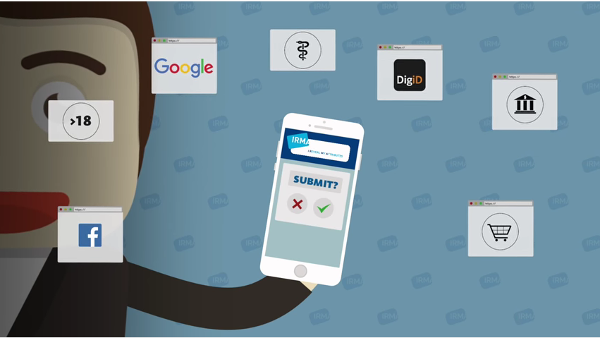

 1. Ik ben een **persoon** die IRMA misschien wil gebruiken om online
    in te kunnen loggen.

    U kunt IRMA uitproberen door de IRMA app te
    [installeren](https://play.google.com/store/apps/details?id=org.irmacard.cardemu)
    (op een Android telefoon) en u bij de stichting Privacy by Design
    te registreren, enkel met een email adres. U kunt daarna
    eventueel nog andere attributen in uw app [toevoegen](/enroll), waarmee u
    een soort digitaal paspoort op uw telefoon vult. Ook kunt u het
    gebruik van de app volgen in een eigen [mijnIRMA](/mijnirma) omgeving. U
    kunt uzelf daar op ieder moment afmelden en al uw gegevens wissen.
    Hier zijn geen kosten aan verbonden.

    Wilt u eerst meer lezen over IRMA, bekijk dan [deze pagina](/irma-uitleg).

 2. Ik ben van een **webwinkel** of andere **organisatie** die IRMA
    misschien wil gebruiken om klanten/leden in te laten loggen.

    De eerste vraag die u zich hierbij moet stellen is: welke
    attributen wil ik van mijn klanten controleren bij het inloggen? U
    heeft misschien voldoende aan een emailadres of een mobiel nummer,
    maar mogelijk heeft u ook adresgegevens nodig. Op een aparte
    pagina wordt meer [informatie](/irma-controleur) hierover gegeven.

 3. Ik ben gewoon **nieuwsgierig** en wil meer over IRMA weten.

    Met IRMA kun gebruikers zelf hun inloggegevens beheren&#58; met
    IRMA laten gebruikers alleen die dingen van zichzelf zien die
    nodig zijn en die ze zelf ook wil onthullen, zie de volgende
    introductie-video (van de Radboud Universiteit, uit 2016)&#58;

    

    Op het web moet u vaak bewijzen wie u bent. Dat heet
    *authenticatie*. U moet dan bijvoorbeeld uw naam geven, uw
    geboortedatum en uw emailadres, terwijl enkel nodig is dat u boven
    de 16 bent. Met IRMA kunt u heel selectief zulke eigenschappen
    (attributen) van uzelf onthullen. Er is een IRMA app, waarmee u
    deze eigenschappen op uw mobiele telefoon op kunt slaan. Hiermee
    hebt u een flexibel paspoort, waaruit u sommige dingen wel en
    andere dingen niet laat zien, afhankelijk van de situatie.

    Op een aparte pagina staat nog [veel meer uitleg](/irma-uitleg)
    over attributen en IRMA.
