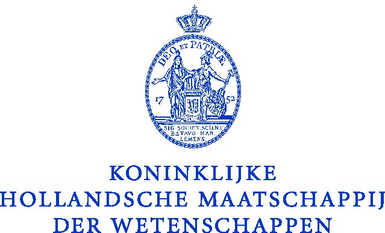
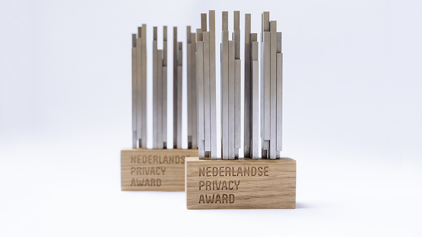

Op deze pagina staan de prijzen die de stichting Privacy by Design
ontvangen heeft voor het identiteitsplatform IRMA. 

### Brouwer prijs 2018 

 De
 Koninklijk Hollands Maatschappij der Wetenschappen
 ([KHMW](https://www.khmw.nl)) rijkt jaarlijks de [Brouwer
 prijs](https://www.khmw.nl/brouwer-prijs-voor-wetenschap-en-samenleving/)
 uit voor wetenschap en samenleving. Deze prijs wordt in 2018
 toegekend aan de stichting Privacy by Design. De jury waardeert dat
 de stichting met IRMA mensen weer grip op de bescherming van
 persoonsgegevens verschaft en daarmee, bij alle technologische
 ontwikkelingen, vertrouwen in de samenleving geeft. De jury, heeft
 naast de maatschappelijke urgentie van het initiatief, vooral het
 criterium van de wetenschappelijke onderbouwing zwaar laten wegen.
 Aan de prijs is een geldbedrag van honderdduizend Euro verbonden.

### Nederlandse Privacy Award 2018

 De
stichting [Privacy First](https://privacyfirst.nl/) heeft in january
2018 de *Nederlandse Privacy Award* toegekend aan het
identiteitsplatform IRMA. De
[jury](https://privacyfirst.nl/solutions/evenementen/item/1104-winnaars-nederlandse-privacy-awards-2018.html)
prijst de privacy by design-opzet, het grote innovatieve vermogen, en
de potentiële maatschappelijke impact van IRMA. Deze prijs is een
eervolle erkenning van IRMA's sterke focus op privacybescherming. Er
is geen geldbedrag aan verbonden, maar wel een kunstwerk, zoals op
afgebeeld op het bijgaande plaatje.

